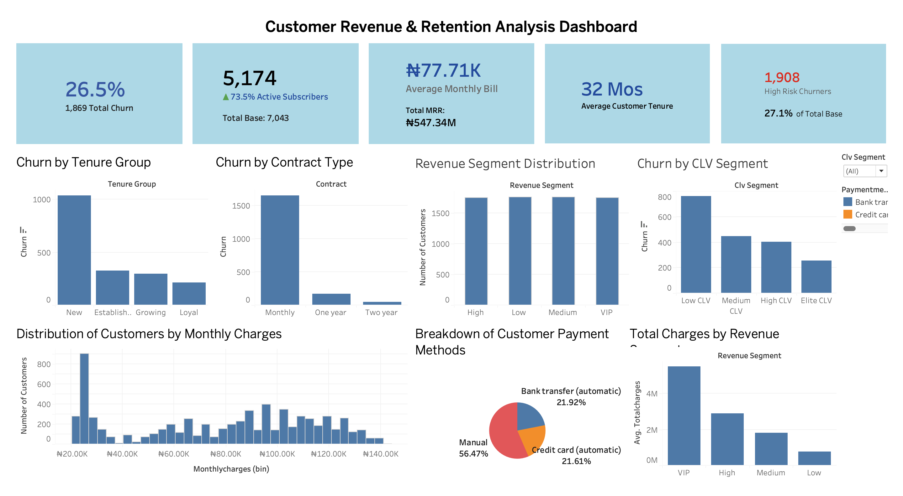
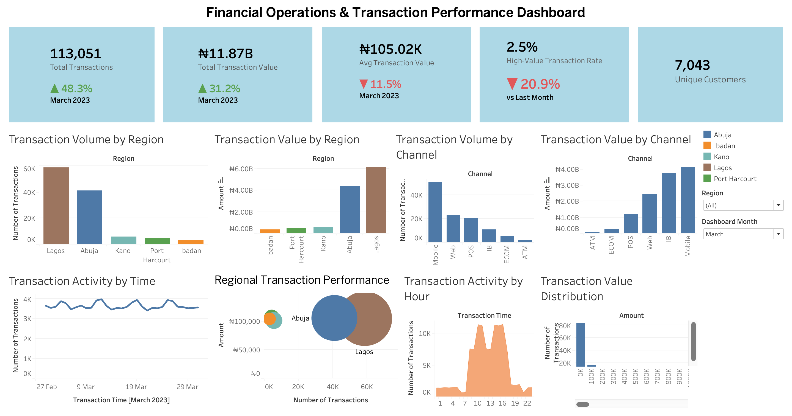
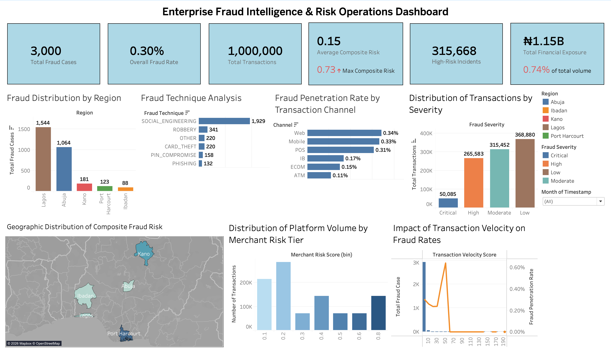
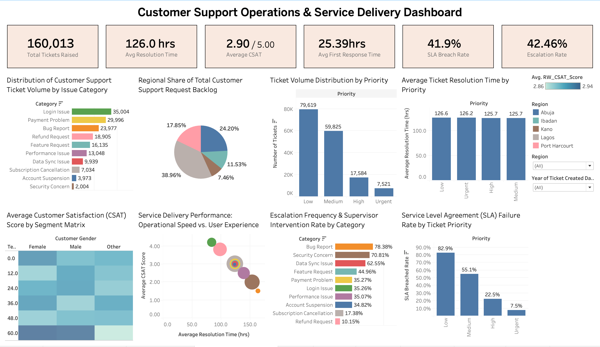
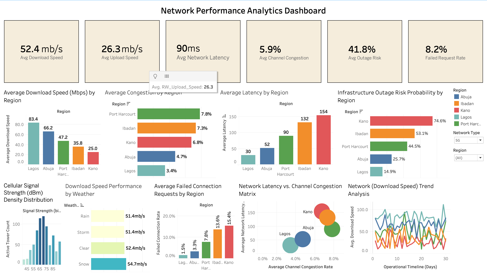

# Fintech & Telecom Business Intelligence Analytics

A business intelligence project that transforms multi-domain operational data into interactive dashboards and actionable business insights using Python and Tableau.

## Project Overview

This project presents an end-to-end fintech and telecom analytics solution developed using Python and Tableau. It combines multiple datasets covering customer information, financial transactions, fraud detection, customer support, and network performance to generate business insights and support data-driven decision-making.

The project demonstrates the complete analytics workflow, including data cleaning, feature engineering, KPI development, exploratory data analysis, cross-dataset analysis, and interactive dashboard creation. The resulting dashboards provide stakeholders with a comprehensive view of customer behavior, operational performance, fraud risk, and network reliability.

## Objectives

* Clean and prepare multiple datasets for analysis.
* Engineer meaningful features and business KPIs to improve analytical insights.
* Analyze customer behavior, transaction patterns, fraud trends, support operations, and network performance.
* Explore relationships across datasets to uncover business insights.
* Develop interactive Tableau dashboards for different business functions.
* Present actionable insights and recommendations to support strategic decision-making.

## Datasets Used

This project integrates four publicly available datasets to simulate a real-world fintech and telecom business environment. All datasets used in this project are from Kaggle.

| Dataset                                                                              | Description                                                                                                              |
| ------------------------------------------------------------------------------------ | ------------------------------------------------------------------------------------------------------------------------ |
| [TelecomCustomerChurn.csv](data/TelecomCustomerChurn.csv)                                 | Customer demographics, subscription details, billing information, and churn status.                                      |
| [nibss_fraud_dataset_update_3.csv.gz](data/nibss_fraud_dataset_update_3.csv.gz)           | Financial transaction records with fraud labels, transaction details, customer information, and fraud risk indicators.   |
| [customer_support_tickets_200k 2.csv.zip](data/customer_support_tickets_200k%202.csv.zip) | Customer support tickets, SLA performance, resolution times, escalation status, and customer satisfaction metrics.       |
| [Telecom_Network_Data.csv](data/Telecom_Network_Data.csv)                                 | Telecom network performance metrics including download/upload speeds, latency, congestion, outages, and signal strength. |

Other columns are derived synthetically to simulate a real-world data analytics project.

## Tools & Technologies

- Python (Pandas, NumPy)
- Jupyter Notebook
- Tableau
- Kaggle
- Git & GitHub

## Project Workflow

The project was completed using the following analytical workflow:

1. **Data Collection** – Gathered and consolidated customer, transaction, fraud, customer support, and network datasets.
2. **Data Cleaning & Preparation** – Handled missing values, corrected data types, removed inconsistencies, and standardized data across datasets.
3. **Feature & KPI Engineering** – Created business-focused features and key performance indicators to support deeper analysis.
4. **Exploratory Data Analysis (EDA)** – Explored trends, distributions, and relationships within each dataset to identify meaningful patterns.
5. **Cross-Dataset Analysis** – Combined insights across multiple datasets to examine customer behavior, fraud exposure, support performance, and network operations.
6. **Dashboard Development** – Designed interactive Tableau dashboards to visualize key metrics and business insights.
7. **Business Insights & Recommendations** – Summarized findings and proposed actionable recommendations to support data-driven decision-making.

## Business Intelligence Dashboards

### 1. Customer Retention Dashboard

Analyzes customer demographics, churn patterns, contract types, tenure, and revenue segments.


🔗 **Interactive Dashboard:** https://surl.li/itqyrd

### 2. Financial Operations & Transaction Performance Dashboard

Provides insights into transaction volume, transaction value, payment channels, regional activity, and customer spending behavior.


🔗 **Interactive Dashboard:** https://surli.cc/mrycne

### 3. Fraud Intelligence Dashboard

Monitors fraud trends, risk scores, fraud severity, and regional fraud exposure.


🔗 **Interactive Dashboard:** https://surl.li/egwrqm

### 4. Customer Support Dashboard

Evaluates ticket performance, SLA compliance, escalations, and customer satisfaction.


🔗 **Interactive Dashboard:** https://surl.li/pzfscy 

### 5. Network Performance Dashboard

Tracks network performance through latency, congestion, outages, and download/upload speeds.


🔗 **Interactive Dashboard:** https://surl.li/jouyjf


## Key Insights

* **Customer Retention:** Customer churn was primarily concentrated among new customers, month-to-month contract subscribers, and low customer lifetime value (CLV) segments, highlighting opportunities for targeted retention strategies.

* **Transaction Performance:** The platform processed high transaction volumes, with Lagos and Abuja contributing the largest share of transaction value. Mobile banking emerged as the most frequently used channel for transactions.

* **Fraud Intelligence:** Although the overall fraud rate remained low, social engineering was the most common fraud technique, with higher fraud exposure observed in high-transaction regions and digital payment channels.

* **Customer Support:** Support operations experienced high SLA breach and escalation rates, while delayed first response times were associated with lower customer satisfaction.

* **Network Performance:** Significant regional differences in network performance were identified. Regions with higher latency and outage rates also showed increased customer support demand, suggesting a relationship between network quality and customer experience.


## Business Recommendations

* Strengthen customer retention by targeting new customers and encouraging migration from month-to-month to long-term contracts.

* Improve transaction monitoring by enhancing fraud detection rules for high-risk channels, regions, and social engineering attacks.

* Optimize customer support operations by reducing first response times, improving SLA compliance, and prioritizing efficient handling of high-impact issues.

* Invest in network infrastructure within underperforming regions to improve service reliability and reduce customer support demand.

* Leverage integrated business intelligence dashboards to continuously monitor customer behavior, operational performance, fraud risk, and network health for proactive decision-making.


## Repository Structure

```text
Fintech-Telecom-Business-Intelligence-Analytics/
│
├── data/
│   ├── TelecomCustomerChurn.csv
│   ├── Telecom_Network_Data.csv
│   ├── customer_support_tickets_200k_2.csv.zip
│   └── nibss_fraud_dataset_update_3.csv.gz
│
├── images/
│   ├── customer_dashboard.png
│   ├── transaction_dashboard.png
│   ├── fraud_dashboard.png
│   ├── support_dashboard.png
│   ├── network_dashboard.png
│   └── executive_dashboard.png
│
├── notebooks/
│   └── Fintech_Telecom_Analytics.ipynb
│
├── README.md
└── requirements.txt
```


## How to Run the Project

1. Clone this repository to your local machine.

2. Install the required Python libraries:

```bash
pip install -r requirements.txt
```

3. Open the Jupyter notebooks:

* `Fintech_Telecom_Analytics.ipynb`

4. Run the notebooks sequentially to reproduce the data preparation, feature engineering, exploratory analysis, and business insights.

5. Open the Tableau workbook using the links provided just after the images to explore the interactive dashboards.

## Future Improvements

* Integrate real-time transaction and network monitoring.
* Develop predictive machine learning models for churn and fraud detection.
* Expand the executive dashboard with additional business performance metrics.


